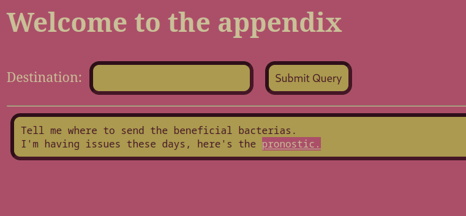
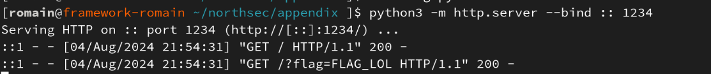

# Appendix

Ce writeup est à propos du challenge "Appendix" de l'édition 2024 du Northsec CTF

## Recréation du challenge

Pour tester ce challenge à la maison, téléchargez les fichiers [flag.py](flag.py) et [script.py](script.py), puis lancez les commandes suivantes:

```bash
python -m venv env
source ./env/bin/activate
pip install flask requests
flask --app script run --debug
```

Le challenge sera alors disponible sur <http://localhost:5000>

## Exploration

En accédant à l'URL, on tombe sur un joli site web tout rose, comme on peut le voir ci-dessous:



Si on entre la valeur "test" dans le champ Destination et qu'on clique sur le bouton, on obtient comme réponse:

```
Invalid destination: test
Message: Invalid URL 'test': No scheme supplied. Perhaps you meant https://test?
```

Si on ajoute le "https", on revient au message de départ.

Si on clique sur le bouton pronostic, on obtient le code source, une très bonne nouvelle quand on ne vient pas de le télécharger sur ce writeup!

## Analyse du code

On peut voir dans le code à la ligne 43 que le serveur essaye de se connecter à la valeur donnée dans "Destination", et si une première requête HTTP envoyée reçoit une réponse, une deuxième est envoyée avec le flag dans le corps de la requête.

Dans ce cas, on pourrait simplement ouvrir un serveur HTTP Python:

```
python3 -m http.server --bind :: 1234
```

Puis donner l'URL "http://localhost:1234/" au serveur.

Malheureusement, en faisant ça, on reçoit de nouveau le message d'accueil, et aucune requête n'a été envoyée.

En cherchant un peu plus loin, on voit que la fonction "malfunction" est appelée pour modifier l'entrée avant de faire la requête, peut-être que le problème vient de là...

En effet! Les appels à urlsplit et urlunsplit suppriment tout ce qui est avant le "/" final de l'URL, c'est embêtant. J'essaye quelques combinaisons un peu étranges pour essayer de bypasser les fonctions, mais sans résultat...

Par exemple, en mettant "/http://localhost:1234", avec un "/" au début, on peut passthrough notre URL jusqu'à la dernière étape, mais la requête ne sera malheureusement pas exécutée car "/http://" n'est pas un scheme valide.

## La faille !

En recherchant sur Google "CVE urlsplit", on tombe sur un article qui explique qu'il existe une vulnérabilité dans certaines versions de Python, où l'on peut entrer une URL avec un espace vide " " au tout début, afin d'éviter les filtres appliqués sur le résultat d'urlsplit.

L'article : <https://medium.com/thesecmaster/how-to-fix-cve-2023-24329-url-parsing-issue-in-python-794018e4b57a#1005>

Malheureusement, cette faille a été réparée sur la version utilisée sur le serveur, cette solution ne fonctionne donc pas.

En cherchant un peu plus, on peut trouver le code source d'urlsplit sur GitHub, et c'est en particulier le `url = url.lstrip(_WHATWG_C0_CONTROL_OR_SPACE)` ([lien](https://github.com/python/cpython/blob/be257c58152e9b960827362b11c9ef2223fd6267/Lib/urllib/parse.py#L477)) qui nous intéresse. En effet, les espaces et les caractères de contrôles sont enlevés, mais pas les autres caractères Unicode.

En s'inspirant de la faille présentée et du code source de Python, on peut essayer une variante similaire, en insérant au début de l'URL le caractère [Unicode demi-espace U+2009](https://www.compart.com/en/unicode/U+2009). On met donc comme payload "&ThinSpace;http://localhost:1234" où le premier caractère est un demi espace.

On obtient alors le message "Beneficial bacterias successfully delivered.", et le flag s'affiche dans notre console !!


